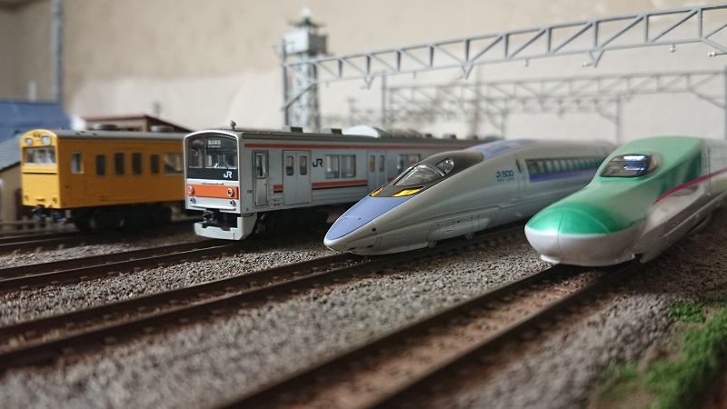

# 概要(About)
はじめまして！D.Mと申します。  
ニコニコ動画で鉄道模型の動画を投稿したり、ニコ生用アプリを開発しています。  
プログラミング歴は最初に扱ったhtmlも含めると10年くらい。  
趣味は、鉄道模型、ゲーム制作、サバゲー、車など色々あります。  

## わたしの情報(Profile)
- 名前:D.M(でぃーえむ
- 所在地:千葉県
- 得意領域:N予備校のプログラム入門Webアプリの講座を履修中、ニコ生用アプリケーションを開発しています。

# やったことがあること(Skills)
- OS:Windows, Linux
- Languages:HTML, CSS, JavaScript, Ruby
- Engine,Frameworks:Node.js, Express, Akashic Engine
- Tool, MiddleWare:Git, PostgreSQL

# 作ったもの(Works)
- [GitHub](https://github.com/DM2525)
- [Qiita(未登録)]()
- [アツマール](https://game.nicovideo.jp/atsumaru/users/84757291)

# SNSへのリンク(Contact)
- [Twitter](https://twitter.com/DM29181979)
- [LinkedIn(未登録)]()

# 経歴(History)
- 経歴は非公開です(-_-;)

<noscript><a href="https://www.nicovideo.jp/watch/sm33763553">【ゆっくり】レイアウトを作ってみた</a></noscript>

<a class="twitter-timeline" data-width="400" data-height="600" data-theme="dark" href="https://twitter.com/DM29181979?ref_src=twsrc%5Etfw">Tweets by DM29181979</a>  
